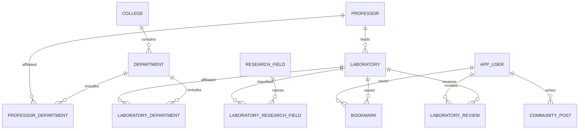

# SEBU 데이터 모델

SEBU의 데이터는 연구실 탐색, 복수 소속과 출처, 커뮤니티, 계정 생명주기를 함께 모델링한다. `develop` 기준 확인한 마이그레이션 최고 버전은 **V50**이며, 운영 DB 적용 버전을 뜻하지는 않는다.

핵심 관계만 축약했다. 후보·인증 토큰·분류 매핑·댓글·반응 테이블은 생략했으므로 전체 제약은 마이그레이션을 확인한다.

## 보존해야 하는 규칙

- 대표 학과 컬럼과 복수 학과 연결 테이블은 별도 역할이다. [[SEBU 결정 - 복수 학과와 출처 보존]]
- 활성 연구실 이름은 대표 학과 내에서 유일하다. 삭제 행의 생성 컬럼 `active_name`은 NULL이 되어 이력 보존과 이름 재사용을 허용한다.
- 모집 상태는 `RECRUITING / ALWAYS_OPEN / CLOSED / UNKNOWN` 네 가지다.
- 북마크는 사용자와 연구실의 관계다. 목록의 `bookmarkCount`는 탈퇴하지 않은 사용자의 북마크 집계이며, `bookmarked`는 요청 사용자 자신의 저장 여부다. 둘 다 DB 단일 컬럼이라고 가정하지 않는다.
- `reviewCount`는 활성 후기 집계다. 연구실 목록에 수가 포함돼도 실제 후기 내용은 별도 후기 API에서 읽는다.
- 연구실 명칭 출처는 `OFFICIAL/GENERATED`, 홈페이지 출처는 `CRAWLED/MANUAL`이다. V46은 URL과 출처의 NULL 여부가 일치하도록 제약한다.
- 카테고리 `parent_id`는 같은 테이블의 부모 ID를 참조하고 최상위는 NULL이다. V47은 부모 삭제를 제한하는 외래 키와 `(parent_id, display_order)` 인덱스를 추가한다. 로봇 부모의 ID·코드를 유지한 채 하위 분류 20개로 직접 매핑을 옮기며 분야명은 바꾸지 않는다. [[SEBU 연구 분야 분류]]
- 연구실 응답의 카테고리 ID는 직접 매핑된 값이다. `parentId`가 있어도 부모 카테고리 ID를 자동으로 추가하지 않는다.
- `grade=5`는 5학년이 아니라 졸업생이다.
- 사용자 `deleted_at`, `anonymized_at`, `auth_version`은 각각 탈퇴, 익명화 완료, 인증 버전을 나타낸다. [[SEBU 탈퇴와 복구]]

## 변경을 반영하는 방법

대표 변화는 V16 복수 소속 → V28 커뮤니티 → V29 후기 → V37~V39 인증·복구 → V40 졸업생 → V46 홈페이지 출처 → V47 분류 계층 → V48~V49 예체능 데이터 → V50 물리천문학과 링크 보완이다. 초기 ERD보다 실제 Flyway SQL·엔티티·DTO를 우선 대조한다.

V48은 예체능대학 6개 출처와 교수·연구실 각 18개, 소속 연결을 누락된 경우에만 추가한다. V49는 기존 분야·카테고리·연결을 재사용하면서 분야 54개, 연구실–분야 61개, 카테고리 2개, 분야–카테고리 68개를 추가하는 기본 데이터 변경이다. 기존 프로필과 후보 검수 이력은 그대로 유지한다. 검수된 대상 중 연구소개가 없는 3명의 분야는 생성하지 않는다.

빈 DB 전체 마이그레이션 계약 테스트의 기대값은 교수·연구실 각 321개, 분야 1,035개, 연구실–분야 연결 1,133개, 카테고리 54개다. 사용자 입력이나 기존 운영 데이터가 있는 DB의 현재 건수로 사용하지 않는다. 당시 수집·검증 결과는 [[SEBU 예체능대학 크롤링 검수 - 2026-10-06]]에 기록한다.

V50은 물리천문학과의 활성 연구실 14개를 대상으로 빠진 홈페이지 URL만 보완한다. 교수 이름·이메일, 단과대·학과, 연구실 이름을 함께 대조하며 숫자 ID를 고정하지 않는다. 기존 URL과 삭제 연구실은 건드리지 않고 새 교수·연구실도 만들지 않는다. 공식 교수 홈페이지 13개와 검수 대상으로 전달된 RnDCircle 프로필 1개를 `MANUAL` 출처로 기록한다. 모든 링크가 독립 연구실 홈페이지라는 뜻은 아니다.

V50 계약 테스트는 대상 행의 URL·출처·수정시각 외에 신원·소속·연구 분야·후기·북마크를 보존하는지, 기존 URL과 이름·소속 불일치 대상을 건너뛰는지, 재실행이 데이터를 바꾸지 않는지를 다룬다. 빈 DB에는 대상 교수가 없어 V49의 데이터 건수를 바꾸지 않는 계약도 있다. 이번 문서 갱신에서는 SQL·테스트 코드를 확인했으며 테스트 재실행·운영 적용·외부 링크 재접속은 하지 않았다.

운영 초기화에는 이 기본 데이터 외에 개발 DB의 전체 연구 정보가 필요하다. 10월 8일 격리 복원에서는 교수·연구실 각 **622개**, 연구 분야 1,899개와 연결·출처를 보존했고 테스트 후기는 0개로 유지했다. 11개 연구 정보 테이블만 이관하며 사용자·활동·후보 12개와 Flyway 이력은 복사하지 않는다. [[SEBU 운영 전환과 연구 정보 이관]] · [[SEBU 운영 준비 검증 기록 - 2026-10-08]]

이미 적용한 SQL·Java 마이그레이션은 수정하지 않고 새 버전으로 전진 수정한다. 코드 PR과 함께 문서의 관계·제약·기준 커밋을 갱신한다. [[SEBU 지식 갱신 방법]]

## 이전된 상세 문서

- [[SEBU 백엔드 연구실 ERD]]
- [[SEBU 백엔드 교수 후보 승격 실행 안내]]

<!-- sources:start -->
## 근거 파일

- [백엔드 · ops/deploy/catalog_transfer.py](https://github.com/greedy-team/SEBU-backend/blob/bb7372518cb2d69f0e83cad2ec760a8920c7f964/ops/deploy/catalog_transfer.py)
- [백엔드 · ops/deploy/verify-production-seed.sql](https://github.com/greedy-team/SEBU-backend/blob/bb7372518cb2d69f0e83cad2ec760a8920c7f964/ops/deploy/verify-production-seed.sql)
- [백엔드 · src/main/resources/db/migration/V6__add_active_laboratory_name_unique_constraint.sql](https://github.com/greedy-team/SEBU-backend/blob/bb7372518cb2d69f0e83cad2ec760a8920c7f964/src/main/resources/db/migration/V6__add_active_laboratory_name_unique_constraint.sql)
- [백엔드 · src/main/resources/db/migration/V7__add_unknown_recruitment_status.sql](https://github.com/greedy-team/SEBU-backend/blob/bb7372518cb2d69f0e83cad2ec760a8920c7f964/src/main/resources/db/migration/V7__add_unknown_recruitment_status.sql)
- [백엔드 · src/main/resources/db/migration/V16__add_multi_department_affiliations.sql](https://github.com/greedy-team/SEBU-backend/blob/bb7372518cb2d69f0e83cad2ec760a8920c7f964/src/main/resources/db/migration/V16__add_multi_department_affiliations.sql)
- [백엔드 · src/main/resources/db/migration/V28__create_community_posting_tables.sql](https://github.com/greedy-team/SEBU-backend/blob/bb7372518cb2d69f0e83cad2ec760a8920c7f964/src/main/resources/db/migration/V28__create_community_posting_tables.sql)
- [백엔드 · src/main/resources/db/migration/V29__create_laboratory_reviews.sql](https://github.com/greedy-team/SEBU-backend/blob/bb7372518cb2d69f0e83cad2ec760a8920c7f964/src/main/resources/db/migration/V29__create_laboratory_reviews.sql)
- [백엔드 · src/main/resources/db/migration/V38__add_account_recovery_and_anonymization.sql](https://github.com/greedy-team/SEBU-backend/blob/bb7372518cb2d69f0e83cad2ec760a8920c7f964/src/main/resources/db/migration/V38__add_account_recovery_and_anonymization.sql)
- [백엔드 · src/main/resources/db/migration/V39__add_app_user_auth_version.sql](https://github.com/greedy-team/SEBU-backend/blob/bb7372518cb2d69f0e83cad2ec760a8920c7f964/src/main/resources/db/migration/V39__add_app_user_auth_version.sql)
- [백엔드 · src/main/resources/db/migration/V40__allow_graduate_grade.sql](https://github.com/greedy-team/SEBU-backend/blob/bb7372518cb2d69f0e83cad2ec760a8920c7f964/src/main/resources/db/migration/V40__allow_graduate_grade.sql)
- [백엔드 · src/main/resources/db/migration/V46__add_laboratory_website_url_source.sql](https://github.com/greedy-team/SEBU-backend/blob/bb7372518cb2d69f0e83cad2ec760a8920c7f964/src/main/resources/db/migration/V46__add_laboratory_website_url_source.sql)
- [백엔드 · src/main/resources/db/migration/V47__add_robot_autonomous_subcategories.sql](https://github.com/greedy-team/SEBU-backend/blob/bb7372518cb2d69f0e83cad2ec760a8920c7f964/src/main/resources/db/migration/V47__add_robot_autonomous_subcategories.sql)
- [백엔드 · src/main/resources/db/migration/V48__import_reviewed_arts_sports_professors.sql](https://github.com/greedy-team/SEBU-backend/blob/bb7372518cb2d69f0e83cad2ec760a8920c7f964/src/main/resources/db/migration/V48__import_reviewed_arts_sports_professors.sql)
- [백엔드 · src/main/resources/db/migration/V49__import_reviewed_arts_sports_research_fields.sql](https://github.com/greedy-team/SEBU-backend/blob/bb7372518cb2d69f0e83cad2ec760a8920c7f964/src/main/resources/db/migration/V49__import_reviewed_arts_sports_research_fields.sql)
- [백엔드 · src/main/java/com/sebu/backend/researchfield/category/domain/ResearchFieldCategory.java](https://github.com/greedy-team/SEBU-backend/blob/bb7372518cb2d69f0e83cad2ec760a8920c7f964/src/main/java/com/sebu/backend/researchfield/category/domain/ResearchFieldCategory.java)
- [백엔드 · src/test/java/com/sebu/backend/researchfield/category/repository/ArtsSportsResearchFieldMigrationContract.java](https://github.com/greedy-team/SEBU-backend/blob/bb7372518cb2d69f0e83cad2ec760a8920c7f964/src/test/java/com/sebu/backend/researchfield/category/repository/ArtsSportsResearchFieldMigrationContract.java)
- [백엔드 · src/main/java/com/sebu/backend/laboratory/repository/LaboratoryRepository.java](https://github.com/greedy-team/SEBU-backend/blob/bb7372518cb2d69f0e83cad2ec760a8920c7f964/src/main/java/com/sebu/backend/laboratory/repository/LaboratoryRepository.java)
- [백엔드 · src/main/java/com/sebu/backend/laboratory/service/LaboratoryQueryService.java](https://github.com/greedy-team/SEBU-backend/blob/bb7372518cb2d69f0e83cad2ec760a8920c7f964/src/main/java/com/sebu/backend/laboratory/service/LaboratoryQueryService.java)
- [백엔드 · src/main/resources/db/migration/V50__add_missing_physics_astronomy_laboratory_links.sql](https://github.com/greedy-team/SEBU-backend/blob/bb7372518cb2d69f0e83cad2ec760a8920c7f964/src/main/resources/db/migration/V50__add_missing_physics_astronomy_laboratory_links.sql)
- [백엔드 · src/test/java/com/sebu/backend/laboratory/repository/PhysicsAstronomyLaboratoryLinksMigrationContract.java](https://github.com/greedy-team/SEBU-backend/blob/bb7372518cb2d69f0e83cad2ec760a8920c7f964/src/test/java/com/sebu/backend/laboratory/repository/PhysicsAstronomyLaboratoryLinksMigrationContract.java)

기준 커밋은 [[SEBU 저장소와 기준 버전]]에서 확인한다.
<!-- sources:end -->

---
[[SEBU 홈]] · [[SEBU 지식 지도]]
