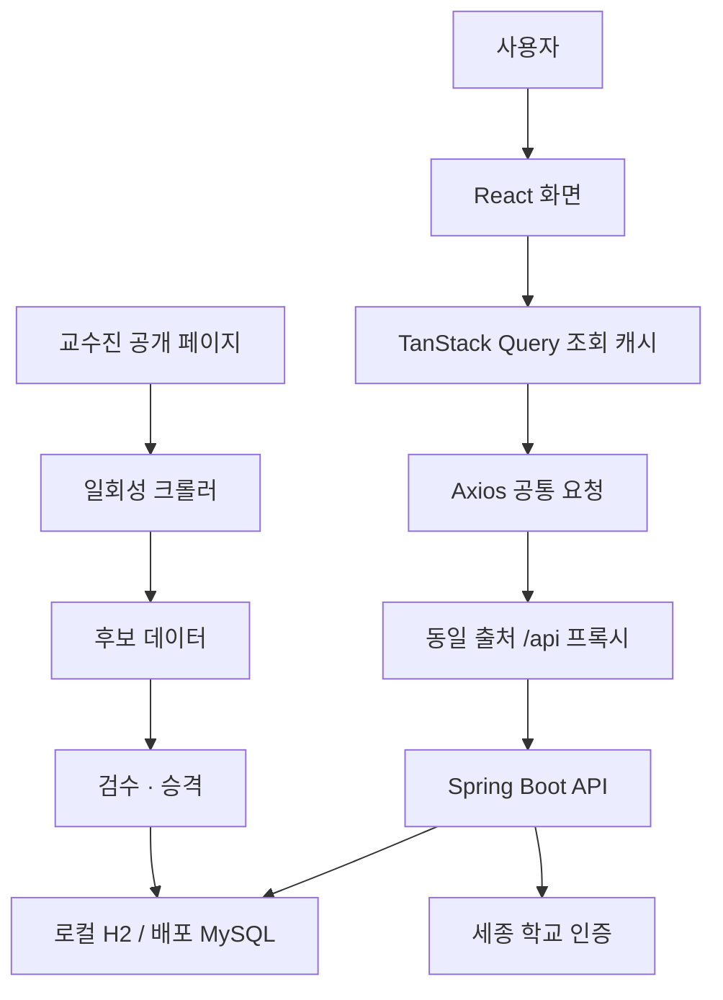

# SEBU 시스템 구조

SEBU는 React 화면, Spring Boot API, 관계형 DB, 검수형 데이터 수집 배치로 구성된다. 프론트의 조회 캐시와 서버 데이터는 서로 다른 계층이다.

## 실행 경계

프론트의 Axios client는 /api/v1을 기준으로 쿠키·CSRF 요청을 다룬다. 개발 환경은 Vite 프록시, 배포 설정은 vercel.json의 /api rewrite를 사용한다.

검색·단과대·랩실평가 홈은 하나의 연구실 목록 쿼리를 공유한다. 캐시가 유효하면 같은 데이터를 재사용하고 로그인 사용자가 달라지면 사용자별 북마크 상태를 갱신한다. [[SEBU 화면과 API 공유]]

백엔드는 요청 권한·업무 규칙·DB 조회와 저장을 담당한다. 크롤러와 승격은 일반 웹 요청과 별도 프로필로 실행한다.

## 구조에서 찾아갈 곳

[[SEBU 프론트엔드 구조]] · [[SEBU 백엔드 구조]] · [[SEBU 데이터 모델]] · [[SEBU 배포와 모니터링]]

CORS를 허용했다는 사실만으로 쿠키·CSRF가 필요한 요청을 별도 사이트의 API 직접 호출로 바꿀 수 있다고 가정하지 않는다. [[SEBU 공개 API와 CORS]]

<!-- sources:start -->
## 근거 파일

- [백엔드 · build.gradle](https://github.com/greedy-team/SEBU-backend/blob/f06c597bab64fb1559754644e633aea92be4fd2e/build.gradle)
- [백엔드 · README.md](https://github.com/greedy-team/SEBU-backend/blob/f06c597bab64fb1559754644e633aea92be4fd2e/README.md)
- [백엔드 · docs/professor-promotion.md](https://github.com/greedy-team/SEBU-backend/blob/f06c597bab64fb1559754644e633aea92be4fd2e/docs/professor-promotion.md)
- [프론트 · src/main.jsx](https://github.com/greedy-team/SEBU-frontend/blob/2fb75666f9f75a062222f8f74b434a4ddd067fef/src/main.jsx)
- [프론트 · src/api/client.js](https://github.com/greedy-team/SEBU-frontend/blob/2fb75666f9f75a062222f8f74b434a4ddd067fef/src/api/client.js)
- [프론트 · src/api/queryClient.js](https://github.com/greedy-team/SEBU-frontend/blob/2fb75666f9f75a062222f8f74b434a4ddd067fef/src/api/queryClient.js)
- [프론트 · vite.config.js](https://github.com/greedy-team/SEBU-frontend/blob/2fb75666f9f75a062222f8f74b434a4ddd067fef/vite.config.js)
- [프론트 · vercel.json](https://github.com/greedy-team/SEBU-frontend/blob/2fb75666f9f75a062222f8f74b434a4ddd067fef/vercel.json)

기준 커밋은 [[SEBU 저장소와 기준 버전]]에서 확인한다.
<!-- sources:end -->

---
[[SEBU 홈]] · [[SEBU 지식 지도]]
