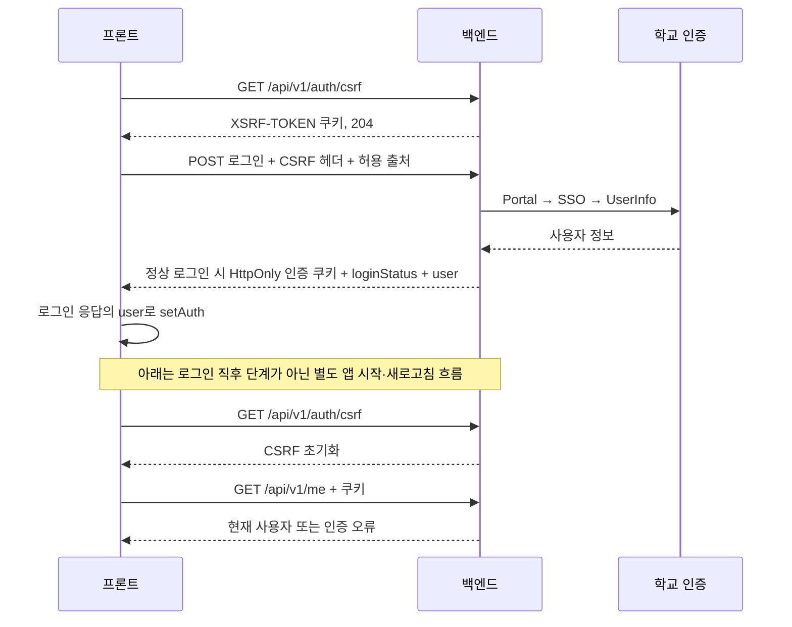

# SEBU 인증과 CSRF

현재 백엔드와 프론트는 **JWT를 HttpOnly 쿠키로 전달하고, 변경 요청에 CSRF 값을 보내는 흐름**을 갖고 있다. 이전 노트의 ‘프론트는 Bearer 토큰 방식’ 설명은 최신 `dev`에는 맞지 않는다. 다만 오류 처리에는 백엔드 참고 계약과 차이가 남아 있다.

## 로그인과 복원

로그인 POST는 기존 로그인 자격을 요구하지 않지만 학번·비밀번호, 출처, CSRF를 검증한다. `loginStatus=RECOVERY_REQUIRED`는 로그인 완료가 아니라 탈퇴 계정의 복구 확인 단계다. 프론트 `useLogin`은 이 상태를 분기한다.

정상 로그인은 응답에 포함된 `user`로 로그인 상태를 설정한다. `/me` 조회는 앱 시작·새로고침 시 기존 쿠키로 사용자를 복원하는 `useAuthRestore`의 역할이며, 로그인 성공 직후 반드시 이어지는 요청은 아니다. 복원 중 `/me` 조회에 실패하면 아래 설명처럼 갱신과 재조회를 시도한다.

| 쿠키 | 역할 | Path · 기본 수명 |
|---|---|---|
| access_token | API 인증 JWT, HttpOnly | /api/v1 · 30분 |
| refresh_token | 갱신, HttpOnly | /api/v1/auth · 최근 로그인/갱신부터 12시간 이내 |
| recovery_token | 명시적 계정 복구, HttpOnly | /api/v1/auth/recovery · 최대 5분 |
| XSRF-TOKEN | JS가 읽어 X-XSRF-TOKEN 헤더에 전달 | / · 세션 쿠키 |

Access/Refresh 수명은 최초 로그인으로부터 30일인 절대 만료를 넘지 않는다. 로그인·복구·로그아웃·탈퇴 후 CSRF가 바뀌므로 현재 쿠키 값을 읽어야 한다.

## 프론트에 구현된 경로

- `src/api/client.js`: `/api/v1`, `withCredentials`, XSRF 쿠키·헤더 이름, 응답 인터셉터.
- `useAuthRestore`: 앱 시작 시 CSRF 초기화 → `/me` → 실패 시 refresh → `/me` 재조회.
- `authStore`: 토큰 원문 대신 `user`와 `loading/authenticated/anonymous` 상태를 관리.
- `vercel.json`: 프론트 동일 출처 `/api`를 API 서버로 전달.

‘코드가 존재한다’는 확인이며 실제 학교 로그인·배포 프록시 동작을 이번 문서 갱신에서 실행 검증하지 않았다.

## 쿠키·출처·프록시는 함께 맞춰야 한다

쿠키는 Domain 미지정, `SameSite=Lax`다. HTTPS 환경에서는 Secure이며 `local`만 HTTP를 위해 false다. 브라우저가 보는 동일 출처 `/api` 프록시가 기본 전제이며, API 호스트에 직접 다른 출처로 요청하도록 바꾸면 CORS뿐 아니라 SameSite·쿠키 읽기·전달 조건도 검토한다.

CORS와 변경 요청의 Origin/Referer 검증은 같은 정확한 출처 목록을 사용한다. 기본 설정에는 기존 Vercel 주소와 `https://sebu.kr`, `https://www.sebu.kr`이 포함된다. 운영 환경 변수로 덮어쓴 실제 값은 별도 확인한다. 프록시는 여러 `Set-Cookie`를 각각 보존해야 한다. [[SEBU 공개 API와 CORS]]

## 로그인 지속시간과 1시간 만료 제안

현재 기본값은 Access 30분, Refresh 유휴 수명 12시간, 로그인 세션 절대 수명 30일이다. `d230a7d`에서 Refresh를 14일에서 12시간으로 줄였고 `21bd49e`에서 관련 쿠키 테스트 기대값을 맞췄다. 새로고침 시 인증 복원과 토큰 갱신이 가능하므로 Access 만료가 곧 최종 로그아웃은 아니다. 유휴 수명은 모든 클릭이 아니라 로그인·Refresh 성공 시각 기준이다.

12시간은 배포 후 새 로그인·복구·갱신으로 발급하는 토큰부터 적용된다. 기존 14일 토큰은 저장된 만료를 유지하고 다음 갱신부터 12시간으로 바뀐다. 기존 토큰을 일괄 폐기하거나 만료를 소급 보정하는 변경은 없다. 코드 반영과 운영 배포 여부는 구분한다.

**1시간 고정 만료·만료 5분 전 안내·사용자 확인 시 연장·만료 모달은 아직 구현되지 않은 제안이다.** 다음 구현 시 아래 경계를 함께 정한다.

- BE의 절대 수명을 1시간으로 정하면 갱신된 Access도 최초 로그인 후 1시간을 넘지 못한다. 다만 현재 설정 검증은 Refresh 수명이 절대 수명 이하여야 하므로 절대 수명만 1시간으로 바꾸고 Refresh 12시간을 유지하면 시작 시 검증에 실패한다. 예를 들어 둘 다 1시간으로 맞추고 Access 30분을 유지할 수 있다.
- 이미 발급된 세션의 DB 만료 시각과 JWT는 설정 변경만으로 소급 단축되지 않는다. 기존 세션 처리 정책은 별도다.
- 서버는 만료 시점에 브라우저로 응답을 먼저 보내지 않는다. FE가 즉시 화면을 바꾸려면 서버가 제공하는 만료 시각과 타이머·탭 복귀 시 재확인을 연동해야 한다. 현재 그런 계약과 UI는 없다.
- 현행 자동 refresh는 최초 절대 만료 시각을 연장하지 않는다. ‘계속 로그인’ 확인으로 새 1시간을 주는 기능은 별도 API·세션 정책 합의가 필요하다.

현재 refresh가 만료·폐기·사용 완료 등으로 실패하면 **401, `error.code=REFRESH_TOKEN_INVALID`**, 메시지 **‘로그인이 만료되었습니다. 다시 로그인해주세요.’**를 반환한다. 내부 `SESSION_EXPIRED` 사유는 이 공개 오류 코드와 구분해 노출하지 않는다. FE는 이 응답만으로 ‘세션 초기화’를 원인으로 단정하면 안 된다. 만료 안내는 이전 로그인 상태와 최종 갱신 실패를 확인해 표시하고, 최초 비로그인·사용자 로그아웃·네트워크 장애와 구분한다.

헤더·모바일 메뉴 로그인은 `pathname + search`를 복귀 정보로 넘긴다. 북마크 공통 훅은 아직 pathname만 보존한다. [[SEBU 마이페이지와 북마크]]

## 남은 오류 처리 차이

백엔드 계약은 인증 401에서 1회 갱신을 시도하되 403·429·502·네트워크 오류와 구별하라고 요구한다. 현재 프론트 코드는 다음을 후속 검토해야 한다.

1. 인터셉터는 `ACCESS_TOKEN_INVALID`를 즉시 `clearAuth`한다. 이 코드에는 Access 쿠키 누락도 포함되므로 이를 탈퇴·버전 불일치로만 해석할 수 없다.
2. 복원 훅은 `/me` 실패의 HTTP 상태를 구분하지 않고 갱신을 시도하고, 실패하면 익명 상태로 바꾼다. 일시적인 서버·네트워크 장애를 비로그인으로 오인할 수 있다.
3. `initCsrf`는 실패를 조용히 넘긴다. 403에서 토큰을 다시 받아도 출처 설정 오류 자체가 고쳐지는 것은 아니다.

이는 문서 감사에서 확인한 검토 항목이며 수정 완료 기록이 아니다. [[SEBU 변경 검토 목록]] · [[SEBU 결정 - 쿠키 인증]] · [[SEBU 탈퇴와 복구]]

## 이전된 상세 문서

- [[SEBU 백엔드 쿠키 인증 계약]]

<!-- sources:start -->
## 근거 파일

- [백엔드 · src/main/java/com/sebu/backend/global/auth/SecurityConfiguration.java](https://github.com/greedy-team/SEBU-backend/blob/d1010d405abfcb5f9b01b155c48032da01ee1d2d/src/main/java/com/sebu/backend/global/auth/SecurityConfiguration.java)
- [백엔드 · src/main/java/com/sebu/backend/global/auth/TrustedOriginFilter.java](https://github.com/greedy-team/SEBU-backend/blob/d1010d405abfcb5f9b01b155c48032da01ee1d2d/src/main/java/com/sebu/backend/global/auth/TrustedOriginFilter.java)
- [백엔드 · src/main/java/com/sebu/backend/auth/controller/AuthCookieFactory.java](https://github.com/greedy-team/SEBU-backend/blob/d1010d405abfcb5f9b01b155c48032da01ee1d2d/src/main/java/com/sebu/backend/auth/controller/AuthCookieFactory.java)
- [백엔드 · src/main/resources/application.yml](https://github.com/greedy-team/SEBU-backend/blob/d1010d405abfcb5f9b01b155c48032da01ee1d2d/src/main/resources/application.yml)
- [백엔드 · src/main/resources/application-local.yml](https://github.com/greedy-team/SEBU-backend/blob/d1010d405abfcb5f9b01b155c48032da01ee1d2d/src/main/resources/application-local.yml)
- [프론트 · src/api/client.js](https://github.com/greedy-team/SEBU-frontend/blob/88eee80d88016b3e3067ac224651143b1d28351f/src/api/client.js)
- [프론트 · src/features/auth/api/authApi.js](https://github.com/greedy-team/SEBU-frontend/blob/88eee80d88016b3e3067ac224651143b1d28351f/src/features/auth/api/authApi.js)
- [프론트 · src/features/auth/hooks/useLogin.js](https://github.com/greedy-team/SEBU-frontend/blob/88eee80d88016b3e3067ac224651143b1d28351f/src/features/auth/hooks/useLogin.js)
- [프론트 · src/features/auth/hooks/useAuthRestore.js](https://github.com/greedy-team/SEBU-frontend/blob/88eee80d88016b3e3067ac224651143b1d28351f/src/features/auth/hooks/useAuthRestore.js)
- [프론트 · src/store/authStore.js](https://github.com/greedy-team/SEBU-frontend/blob/88eee80d88016b3e3067ac224651143b1d28351f/src/store/authStore.js)
- [프론트 · vercel.json](https://github.com/greedy-team/SEBU-frontend/blob/88eee80d88016b3e3067ac224651143b1d28351f/vercel.json)
- [백엔드 · src/main/java/com/sebu/backend/auth/config/TokenProperties.java](https://github.com/greedy-team/SEBU-backend/blob/d1010d405abfcb5f9b01b155c48032da01ee1d2d/src/main/java/com/sebu/backend/auth/config/TokenProperties.java)
- [백엔드 · src/main/java/com/sebu/backend/auth/service/AuthSessionIssuer.java](https://github.com/greedy-team/SEBU-backend/blob/d1010d405abfcb5f9b01b155c48032da01ee1d2d/src/main/java/com/sebu/backend/auth/service/AuthSessionIssuer.java)
- [백엔드 · src/main/java/com/sebu/backend/auth/service/AuthSessionService.java](https://github.com/greedy-team/SEBU-backend/blob/d1010d405abfcb5f9b01b155c48032da01ee1d2d/src/main/java/com/sebu/backend/auth/service/AuthSessionService.java)
- [백엔드 · src/main/java/com/sebu/backend/auth/domain/RefreshToken.java](https://github.com/greedy-team/SEBU-backend/blob/d1010d405abfcb5f9b01b155c48032da01ee1d2d/src/main/java/com/sebu/backend/auth/domain/RefreshToken.java)
- [백엔드 · src/main/java/com/sebu/backend/auth/token/JwtAccessTokenService.java](https://github.com/greedy-team/SEBU-backend/blob/d1010d405abfcb5f9b01b155c48032da01ee1d2d/src/main/java/com/sebu/backend/auth/token/JwtAccessTokenService.java)
- [백엔드 · src/main/java/com/sebu/backend/auth/controller/AuthExceptionHandler.java](https://github.com/greedy-team/SEBU-backend/blob/d1010d405abfcb5f9b01b155c48032da01ee1d2d/src/main/java/com/sebu/backend/auth/controller/AuthExceptionHandler.java)
- [프론트 · src/components/layout/Header.jsx](https://github.com/greedy-team/SEBU-frontend/blob/88eee80d88016b3e3067ac224651143b1d28351f/src/components/layout/Header.jsx)
- [프론트 · src/components/layout/MobileMenu.jsx](https://github.com/greedy-team/SEBU-frontend/blob/88eee80d88016b3e3067ac224651143b1d28351f/src/components/layout/MobileMenu.jsx)
- [프론트 · src/hooks/useLabBookmark.js](https://github.com/greedy-team/SEBU-frontend/blob/88eee80d88016b3e3067ac224651143b1d28351f/src/hooks/useLabBookmark.js)

기준 커밋은 [[SEBU 저장소와 기준 버전]]에서 확인한다.
<!-- sources:end -->

---
[[SEBU 홈]] · [[SEBU 지식 지도]]
