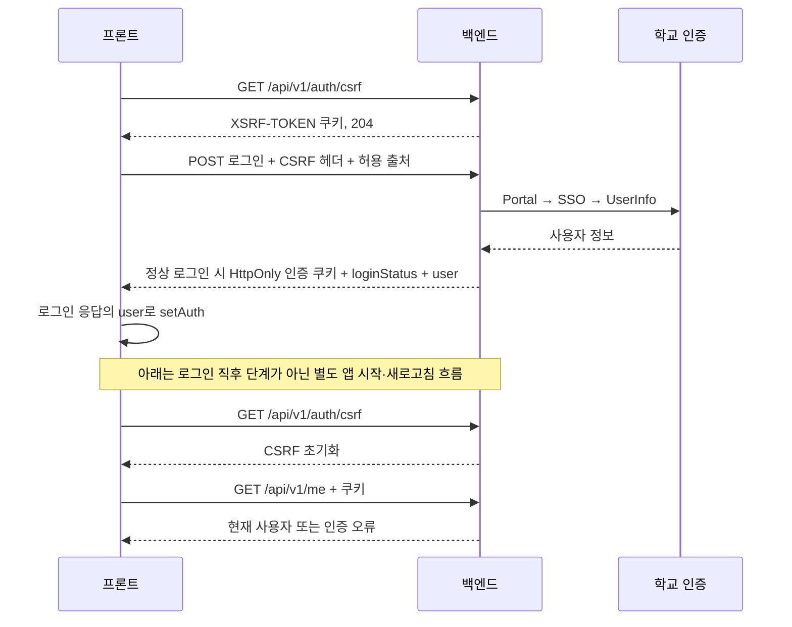

# SEBU 인증과 CSRF

현재 백엔드와 프론트는 **JWT를 HttpOnly 쿠키로 전달하고, 변경 요청에 CSRF 값을 보내는 흐름**을 갖고 있다. 이전 노트의 ‘프론트는 Bearer 토큰 방식’ 설명은 최신 `dev`에는 맞지 않는다. 다만 오류 처리에는 백엔드 참고 계약과 차이가 남아 있다.

## 로그인과 복원

로그인 POST는 기존 로그인 자격을 요구하지 않지만 학번·비밀번호, 출처, CSRF를 검증한다. `loginStatus=RECOVERY_REQUIRED`는 로그인 완료가 아니라 탈퇴 계정의 복구 확인 단계다. 프론트 `useLogin`은 이 상태를 분기한다.

정상 로그인은 응답에 포함된 `user`로 로그인 상태를 설정한다. `/me` 조회는 앱 시작·새로고침 시 기존 쿠키로 사용자를 복원하는 `useAuthRestore`의 역할이며, 로그인 성공 직후 반드시 이어지는 요청은 아니다. 복원 중 `/me` 조회에 실패하면 아래 설명처럼 갱신과 재조회를 시도한다.

| 쿠키 | 역할 | Path · 기본 수명 |
|---|---|---|
| access_token | API 인증 JWT, HttpOnly | /api/v1 · 30분 |
| refresh_token | 갱신, HttpOnly | /api/v1/auth · 최근 로그인/갱신부터 14일 이내 |
| recovery_token | 명시적 계정 복구, HttpOnly | /api/v1/auth/recovery · 최대 5분 |
| XSRF-TOKEN | JS가 읽어 X-XSRF-TOKEN 헤더에 전달 | / · 세션 쿠키 |

Access/Refresh 수명은 최초 로그인으로부터 30일인 절대 만료를 넘지 않는다. 로그인·복구·로그아웃·탈퇴 후 CSRF가 바뀌므로 현재 쿠키 값을 읽어야 한다.

## 프론트에 구현된 경로

- `src/api/client.js`: `/api/v1`, `withCredentials`, XSRF 쿠키·헤더 이름, 응답 인터셉터.
- `useAuthRestore`: 앱 시작 시 CSRF 초기화 → `/me` → 실패 시 refresh → `/me` 재조회.
- `authStore`: 토큰 원문 대신 `user`와 `loading/authenticated/anonymous` 상태를 관리.
- `vercel.json`: 프론트 동일 출처 `/api`를 API 서버로 전달.

‘코드가 존재한다’는 확인이며 실제 학교 로그인·배포 프록시 동작을 이번 문서 갱신에서 실행 검증하지 않았다.

## 쿠키·출처·프록시는 함께 맞춰야 한다

쿠키는 Domain 미지정, `SameSite=Lax`다. HTTPS 환경에서는 Secure이며 `local`만 HTTP를 위해 false다. 브라우저가 보는 동일 출처 `/api` 프록시가 기본 전제이며, API 호스트에 직접 다른 출처로 요청하도록 바꾸면 CORS뿐 아니라 SameSite·쿠키 읽기·전달 조건도 검토한다.

CORS와 변경 요청의 Origin/Referer 검증은 같은 정확한 출처 목록을 사용한다. 프록시는 여러 `Set-Cookie`를 각각 보존해야 한다. [[SEBU 공개 API와 CORS]]

## 남은 오류 처리 차이

백엔드 계약은 인증 401에서 1회 갱신을 시도하되 403·429·502·네트워크 오류와 구별하라고 요구한다. 현재 프론트 코드는 다음을 후속 검토해야 한다.

1. 인터셉터는 `ACCESS_TOKEN_INVALID`를 즉시 `clearAuth`한다. 이 코드에는 Access 쿠키 누락도 포함되므로 이를 탈퇴·버전 불일치로만 해석할 수 없다.
2. 복원 훅은 `/me` 실패의 HTTP 상태를 구분하지 않고 갱신을 시도하고, 실패하면 익명 상태로 바꾼다. 일시적인 서버·네트워크 장애를 비로그인으로 오인할 수 있다.
3. `initCsrf`는 실패를 조용히 넘긴다. 403에서 토큰을 다시 받아도 출처 설정 오류 자체가 고쳐지는 것은 아니다.

이는 문서 감사에서 확인한 검토 항목이며 수정 완료 기록이 아니다. [[SEBU 변경 검토 목록]] · [[SEBU 결정 - 쿠키 인증]] · [[SEBU 탈퇴와 복구]]

<!-- sources:start -->
## 근거 파일

- [백엔드 · docs/cookie-authentication.md](https://github.com/greedy-team/SEBU-backend/blob/f06c597bab64fb1559754644e633aea92be4fd2e/docs/cookie-authentication.md)
- [백엔드 · src/main/java/com/sebu/backend/global/auth/SecurityConfiguration.java](https://github.com/greedy-team/SEBU-backend/blob/f06c597bab64fb1559754644e633aea92be4fd2e/src/main/java/com/sebu/backend/global/auth/SecurityConfiguration.java)
- [백엔드 · src/main/java/com/sebu/backend/global/auth/TrustedOriginFilter.java](https://github.com/greedy-team/SEBU-backend/blob/f06c597bab64fb1559754644e633aea92be4fd2e/src/main/java/com/sebu/backend/global/auth/TrustedOriginFilter.java)
- [백엔드 · src/main/java/com/sebu/backend/auth/controller/AuthCookieFactory.java](https://github.com/greedy-team/SEBU-backend/blob/f06c597bab64fb1559754644e633aea92be4fd2e/src/main/java/com/sebu/backend/auth/controller/AuthCookieFactory.java)
- [백엔드 · src/main/resources/application.yml](https://github.com/greedy-team/SEBU-backend/blob/f06c597bab64fb1559754644e633aea92be4fd2e/src/main/resources/application.yml)
- [백엔드 · src/main/resources/application-local.yml](https://github.com/greedy-team/SEBU-backend/blob/f06c597bab64fb1559754644e633aea92be4fd2e/src/main/resources/application-local.yml)
- [프론트 · src/api/client.js](https://github.com/greedy-team/SEBU-frontend/blob/2fb75666f9f75a062222f8f74b434a4ddd067fef/src/api/client.js)
- [프론트 · src/features/auth/api/authApi.js](https://github.com/greedy-team/SEBU-frontend/blob/2fb75666f9f75a062222f8f74b434a4ddd067fef/src/features/auth/api/authApi.js)
- [프론트 · src/features/auth/hooks/useLogin.js](https://github.com/greedy-team/SEBU-frontend/blob/2fb75666f9f75a062222f8f74b434a4ddd067fef/src/features/auth/hooks/useLogin.js)
- [프론트 · src/features/auth/hooks/useAuthRestore.js](https://github.com/greedy-team/SEBU-frontend/blob/2fb75666f9f75a062222f8f74b434a4ddd067fef/src/features/auth/hooks/useAuthRestore.js)
- [프론트 · src/store/authStore.js](https://github.com/greedy-team/SEBU-frontend/blob/2fb75666f9f75a062222f8f74b434a4ddd067fef/src/store/authStore.js)
- [프론트 · vercel.json](https://github.com/greedy-team/SEBU-frontend/blob/2fb75666f9f75a062222f8f74b434a4ddd067fef/vercel.json)

기준 커밋은 [[SEBU 저장소와 기준 버전]]에서 확인한다.
<!-- sources:end -->

---
[[SEBU 홈]] · [[SEBU 지식 지도]]
