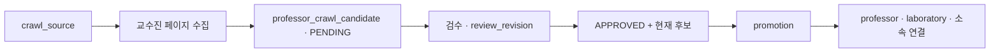

# SEBU 크롤링과 승격

수집한 교수 정보는 곧바로 서비스 데이터가 되지 않는다. 후보를 저장하고 검수한 뒤 승인된 현재 버전만 승격한다.

## 단계별 의미

1. **수집**: 이름·직위·이메일·연구 소개·홈페이지를 후보에 저장한다. 출처 URL과 파서의 수집 시점 정보도 남긴다.
2. **현재성 판정**: 재수집에서 사라진 후보는 stale로 표시하여 이력을 보존한다.
3. **검수**: 승인 시 review_revision을 올려 어떤 승인본인지 구분한다.
4. **승격**: APPROVED이고 is_stale=false인 대상 중 새 승인본을 본 데이터에 반영한다.
5. **재실행**: 같은 승인본을 반복해도 중복을 만들지 않는다. 새 검수본은 연결된 본 데이터를 갱신한다.

## 실행 경계

crawler와 promotion은 각각 전용 프로필과 enabled 설정이 필요한 일회성 작업이다. 일반 API 서버 시작으로 실행되지 않는다. 두 프로필의 동시 실행은 허용하지 않는다.

이 노트는 운영 흐름 설명이다. 실제 DB에 실행할 때는 원본 runbook의 대상 확인·백업·단일 출처 검증 순서를 따른다.

## 데이터 품질 판단

- 공식 연구실 이름이 없으면 교수 이름 기반 이름을 만들고 GENERATED로 표시한다.
- 새 연구실의 모집 상태는 UNKNOWN이다.
- 재승격 시 사람이 관리하는 모집 상태와 MANUAL 홈페이지를 보존한다.
- 원본에서 사라졌다고 기존 서비스 연구실을 자동 삭제하지 않는다.
- 연구소개·분야 원문을 화면용 분류명으로 덮어쓰지 않는다. 분야 후보의 원문·검수 이름·출처 해시·검수 이력을 구분하고, 개발자 매핑으로 카테고리 연결을 관리한다. 빈 원문에는 추정 분야를 생성하지 않는다.

[[SEBU 결정 - 검수 후 승격]] · [[SEBU 결정 - 복수 학과와 출처 보존]] · [[SEBU 연구 분야 분류]]

## 검수 데이터의 마이그레이션 반영

검수한 데이터를 배포용 Flyway SQL로 반영하는 경로도 있다. PR #92는 `b6cf2e5`에서 `develop`에 병합됐으며, V48은 예체능대학 6개 출처와 교수·연구실 각 18개의 누락 데이터 및 소속 연결을 추가한다. V49는 연구소개가 있는 15개 연구실의 분야·분류 연결을 추가한다. 숫자 ID를 고정하지 않고 학과·이메일·이름·활성 연구실을 찾아 기존 데이터를 재사용한다.

두 SQL은 기존 프로필·수동 홈페이지·공식 연구실명·모집 상태·분야 연결을 덮어쓰지 않으며, 신원·출처·연구실·분류 충돌을 본 데이터 추가 전에 확인한다. 기존 승인 후보 이력도 보존하지만 새로운 후보 승인 이력은 만들지 않는다. 수집·승격 Runner의 프로필 제한과 Flyway의 배포 시 적용은 서로 다른 실행 경로다.

빈 DB에 전체 마이그레이션을 적용하는 계약 테스트의 기대값은 교수·연구실 각 321개, 수집 출처 48개다. 이번 갱신은 SQL·테스트 코드와 병합 이력 확인이며, 운영 DB 적용이나 애플리케이션 테스트 재실행을 뜻하지 않는다. MySQL DDL은 트랜잭션으로 모두 되돌릴 수 없으므로 실패 후에는 부분 적용 여부를 확인한다.

2026-10-06 수집·원문 검수·승격과 당시 테스트 결과는 [[SEBU 예체능대학 크롤링 검수 - 2026-10-06]]에 보존한다. 같은 절차를 다시 수행할 때는 [[SEBU 크롤링 스킬]]을 참고한다.

## 홈페이지 보완과 적용 이력 보존

V50은 물리천문학과 14개 대상의 비어 있는 홈페이지를 검수된 링크로 보완하는 후속 마이그레이션이다. 교수 신원·소속·연구실 이름을 대조하며 기존 URL과 삭제 연구실은 보존한다. 공식 교수 홈페이지 13개와 전달받은 RnDCircle 프로필 1개를 `MANUAL`로 기록해 후속 크롤링에서 보호한다. 후보를 새로 수집·승인하거나 교수·연구실·분야를 추가하는 작업은 아니다. [[SEBU 데이터 모델]]

이미 적용한 Flyway SQL·Java 마이그레이션은 고치지 않고 새 버전으로 전진 수정한다. 검수 출처와 연결 근거를 문서에 남기며, 코드 병합·테스트 코드 존재·테스트 실행·실제 DB 적용을 각각 구분한다. 이번 갱신은 로컬 Git 객체의 코드·기록 대조만 수행했다.

## 이전된 상세 문서

- [[SEBU 백엔드 교수 크롤링 실행 안내]]
- [[SEBU 백엔드 교수 후보 승격 실행 안내]]
- [[SEBU 백엔드 연구실 ERD]]

<!-- sources:start -->
## 근거 파일

- [백엔드 · src/main/resources/db/migration/V48__import_reviewed_arts_sports_professors.sql](https://github.com/greedy-team/SEBU-backend/blob/bb7372518cb2d69f0e83cad2ec760a8920c7f964/src/main/resources/db/migration/V48__import_reviewed_arts_sports_professors.sql)
- [백엔드 · src/main/resources/db/migration/V49__import_reviewed_arts_sports_research_fields.sql](https://github.com/greedy-team/SEBU-backend/blob/bb7372518cb2d69f0e83cad2ec760a8920c7f964/src/main/resources/db/migration/V49__import_reviewed_arts_sports_research_fields.sql)
- [백엔드 · src/test/java/com/sebu/backend/crawling/repository/ArtsSportsCatalogMigrationContract.java](https://github.com/greedy-team/SEBU-backend/blob/bb7372518cb2d69f0e83cad2ec760a8920c7f964/src/test/java/com/sebu/backend/crawling/repository/ArtsSportsCatalogMigrationContract.java)
- [백엔드 · src/test/java/com/sebu/backend/researchfield/category/repository/ArtsSportsResearchFieldMigrationContract.java](https://github.com/greedy-team/SEBU-backend/blob/bb7372518cb2d69f0e83cad2ec760a8920c7f964/src/test/java/com/sebu/backend/researchfield/category/repository/ArtsSportsResearchFieldMigrationContract.java)
- [백엔드 · src/main/java/com/sebu/backend/researchfield/candidate/domain/LaboratoryResearchFieldCandidate.java](https://github.com/greedy-team/SEBU-backend/blob/bb7372518cb2d69f0e83cad2ec760a8920c7f964/src/main/java/com/sebu/backend/researchfield/candidate/domain/LaboratoryResearchFieldCandidate.java)
- [백엔드 · src/main/java/com/sebu/backend/researchfield/promotion/service/ResearchFieldNameNormalizer.java](https://github.com/greedy-team/SEBU-backend/blob/bb7372518cb2d69f0e83cad2ec760a8920c7f964/src/main/java/com/sebu/backend/researchfield/promotion/service/ResearchFieldNameNormalizer.java)
- [백엔드 · src/main/resources/db/migration/V50__add_missing_physics_astronomy_laboratory_links.sql](https://github.com/greedy-team/SEBU-backend/blob/bb7372518cb2d69f0e83cad2ec760a8920c7f964/src/main/resources/db/migration/V50__add_missing_physics_astronomy_laboratory_links.sql)
- [백엔드 · src/test/java/com/sebu/backend/laboratory/repository/PhysicsAstronomyLaboratoryLinksMigrationContract.java](https://github.com/greedy-team/SEBU-backend/blob/bb7372518cb2d69f0e83cad2ec760a8920c7f964/src/test/java/com/sebu/backend/laboratory/repository/PhysicsAstronomyLaboratoryLinksMigrationContract.java)

기준 커밋은 [[SEBU 저장소와 기준 버전]]에서 확인한다.
<!-- sources:end -->

---
[[SEBU 홈]] · [[SEBU 지식 지도]]
