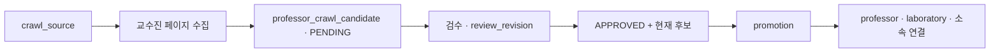

# SEBU 크롤링과 승격

수집한 교수 정보는 곧바로 서비스 데이터가 되지 않는다. 후보를 저장하고 검수한 뒤 승인된 현재 버전만 승격한다.

## 단계별 의미

1. **수집**: 이름·직위·이메일·연구 소개·홈페이지를 후보에 저장한다. 출처 URL과 파서의 수집 시점 정보도 남긴다.
2. **현재성 판정**: 재수집에서 사라진 후보는 stale로 표시하여 이력을 보존한다.
3. **검수**: 승인 시 review_revision을 올려 어떤 승인본인지 구분한다.
4. **승격**: APPROVED이고 is_stale=false인 대상 중 새 승인본을 본 데이터에 반영한다.
5. **재실행**: 같은 승인본을 반복해도 중복을 만들지 않는다. 새 검수본은 연결된 본 데이터를 갱신한다.

## 실행 경계

crawler와 promotion은 각각 전용 프로필과 enabled 설정이 필요한 일회성 작업이다. 일반 API 서버 시작으로 실행되지 않는다. 두 프로필의 동시 실행은 허용하지 않는다.

이 노트는 운영 흐름 설명이다. 실제 DB에 실행할 때는 원본 runbook의 대상 확인·백업·단일 출처 검증 순서를 따른다.

## 데이터 품질 판단

- 공식 연구실 이름이 없으면 교수 이름 기반 이름을 만들고 GENERATED로 표시한다.
- 새 연구실의 모집 상태는 UNKNOWN이다.
- 재승격 시 사람이 관리하는 모집 상태와 MANUAL 홈페이지를 보존한다.
- 원본에서 사라졌다고 기존 서비스 연구실을 자동 삭제하지 않는다.

[[SEBU 결정 - 검수 후 승격]] · [[SEBU 결정 - 복수 학과와 출처 보존]] · [[SEBU 연구 분야 분류]]

## 기준 이후의 검수 기록

2026-10-06 예체능대학 수집·원문 검수·승격 결과는 [[SEBU 예체능대학 크롤링 검수 - 2026-10-06]]에 기록했다. 해당 백엔드 PR #92는 문서 작성 시 미머지 상태이며, 이 노트의 기존 기준 코드나 운영 반영 완료를 뜻하지 않는다. 같은 절차를 다시 수행할 때는 [[SEBU 크롤링 스킬]]을 참고한다.

<!-- sources:start -->
## 근거 파일

- [백엔드 · docs/professor-crawling.md](https://github.com/greedy-team/SEBU-backend/blob/f06c597bab64fb1559754644e633aea92be4fd2e/docs/professor-crawling.md)
- [백엔드 · docs/professor-promotion.md](https://github.com/greedy-team/SEBU-backend/blob/f06c597bab64fb1559754644e633aea92be4fd2e/docs/professor-promotion.md)
- [백엔드 · docs/erd.md](https://github.com/greedy-team/SEBU-backend/blob/f06c597bab64fb1559754644e633aea92be4fd2e/docs/erd.md)

기준 커밋은 [[SEBU 저장소와 기준 버전]]에서 확인한다.
<!-- sources:end -->

---
[[SEBU 홈]] · [[SEBU 지식 지도]]
