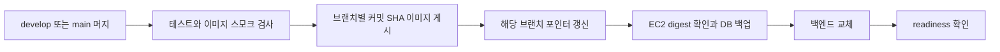

# SEBU 배포와 모니터링

배포 코드는 GitHub Actions에서 검증한 비공개 GHCR 이미지를 EC2가 Pull하여 교체하는 흐름이다. **develop은 개발 이미지, main은 운영 이미지로 구분하며 환경 설정과 DB를 분리한다.** 최초 운영 설정·연구 정보 이관 절차는 [[SEBU 운영 전환과 연구 정보 이관]], 실행 결과는 [[SEBU 운영 준비 검증 기록 - 2026-10-08]]에 정리했다. 운영 서버 생성·실제 배포는 아직 진행하지 않았다.

## CI와 배포의 역할

- `ci.yml`은 배포 스크립트 단위 테스트·셸 문법 검사, Java 테스트, 컨테이너 빌드, 일회용 MySQL 8.0에서 prod 이미지 스모크 검사를 정의한다.
- develop·main의 push 또는 수동 실행 publish 작업은 채널·커밋·마이그레이션 지문을 이미지에 기록한다. 게시 중 해당 브랜치 HEAD가 달라지면 브랜치별 SHA 이미지만 남기고 포인터는 옮기지 않는다. EC2는 자신의 채널과 다른 이미지의 적용을 거부한다.
- EC2 배포 도구의 설치·최초 실행·타이머 활성화는 별도 운영 단계다. 소스에 타이머가 있다고 활성화 상태를 단정하지 않는다.
- 단일 백엔드 컨테이너 교체이므로 짧은 중단이 생길 수 있다.

실패 시 기존·신규 Flyway SQL 지문이 같으면 보존한 이전 컨테이너 시작을 시도한다. SQL이 바뀐 경우 DB 적용 상태를 수동 확인하며 코드·DB를 자동 원복하지 않는다. 이 배포 지문은 SQL 기준이므로 Java 마이그레이션 변경 시 자동 복구 안전성의 충분한 근거로 삼지 않는다. 실제 절차는 현재 runbook과 `deploy.py`를 따른다.

## 최신 응답 압축

9월 26일 `f06c597`에서 추가되어 이번 기준에도 유지되는 `application-prod.yml`에는 `server.compression.enabled=true`, `mime-types=application/json`, `min-response-size=2KB`가 있다.

압축 협상과 서버 조건을 만족하는 JSON 전달 크기를 줄이는 설정이다. 기본 연구실 목록을 페이지 목록으로 바꾸거나 응답 필드를 줄인 것은 아니다. 배포 후 실제 `Content-Encoding`과 전달 크기는 별도 확인한다.

## 운영 전환 후 확인

코드에는 `sebu.kr`·`www.sebu.kr` 허용과 V47 로봇 분류, V48 예체능 교수·연구실, V49 예체능 연구분야 마이그레이션이 포함됐다. 머지 확인만으로 운영 반영을 완료 처리하지 않는다. 실제 이미지 커밋·Flyway 이력·API 응답·출처 설정의 환경 변수 덮어쓰기를 확인해야 한다.

[[SEBU 예체능대학 크롤링 검수 - 2026-10-06]]의 격리 DB 검증 기록 역시 운영 DB 반영의 증거가 아니다.

## 상태 확인·지표·로그

| 수단 | 현재 코드 | 확인 범위 |
|---|---|---|
| readiness | GET /actuator/health/readiness, 기본 그룹에 db 포함 | DB 연결과 상태 확인. 모든 사용자 기능 성공을 보증하지 않음 |
| Docker healthcheck | 컨테이너 내부 위 경로, X-Forwarded-Proto: https, status UP 확인 | 컨테이너 교체의 상태 판정 |
| Prometheus | monitoring 프로필 + 전용 MONITORING_TOKEN | 허용한 HTTP·JVM·DB 풀 지표 |
| JSON 로그 | 요청 요약·보안 사건·traceId | 원인 추적. 수집 전달·보존은 별도 운영 설정 |

`HealthCheckSecurityConfiguration`은 monitoring 프로필이나 수집 토큰 없이 readiness GET만 공개하고 다른 health 경로는 거부한다. Prometheus용 Bearer 토큰은 일반 사용자 쿠키 인증과 다른 관리 경로다.

> [!warning] 원본 문서의 오래된 설명
> `docs/logging.md`에는 Docker 상태 확인이 `/api/v1/laboratories`를 호출한다는 문장이 남아 있다. 현재 `Dockerfile`과 보안 설정은 `/actuator/health/readiness`를 사용한다. 이 노트는 구현을 기준으로 정리했으며 이전 원문 [[SEBU 백엔드 운영 보안 로깅]]에는 역사적 설명을 보존했다. 현재 상태 확인 경로는 코드와 이 노트를 기준으로 확인한다.

`X-Request-ID`, 응답 오류의 `traceId`, 서버 로그를 연결해 추적한다. 원문 비밀번호·토큰·본문·개인정보는 로그에 넣지 않는 계약이다. 출력 큐가 넘치면 보안·ERROR 로그도 유실될 수 있고 `logging.events.dropped`에 기록된다.

현재 운영 서버의 배포 digest, 타이머 실행, 프록시의 쿠키 보존, 실제 메트릭 수집·알림은 아직 검증하지 않았다. CI와 개발 자료의 격리 복원 성공은 운영 배포 완료와 구분한다. [[SEBU 테스트 지도]] · [[SEBU 데이터 모델]] · [[SEBU 인증과 CSRF]]

## 이전된 상세 문서

- [[SEBU 백엔드 EC2 자동 배포 안내]]
- [[SEBU 백엔드 운영 보안 로깅]]

<!-- sources:start -->
## 근거 파일

- [백엔드 · ops/deploy/config.main.example.json](https://github.com/greedy-team/SEBU-backend/blob/d1010d405abfcb5f9b01b155c48032da01ee1d2d/ops/deploy/config.main.example.json)
- [백엔드 · ops/deploy/backend.main.env.example](https://github.com/greedy-team/SEBU-backend/blob/d1010d405abfcb5f9b01b155c48032da01ee1d2d/ops/deploy/backend.main.env.example)
- [백엔드 · ops/deploy/catalog_transfer.py](https://github.com/greedy-team/SEBU-backend/blob/d1010d405abfcb5f9b01b155c48032da01ee1d2d/ops/deploy/catalog_transfer.py)
- [백엔드 · .github/workflows/ci.yml](https://github.com/greedy-team/SEBU-backend/blob/d1010d405abfcb5f9b01b155c48032da01ee1d2d/.github/workflows/ci.yml)
- [백엔드 · Dockerfile](https://github.com/greedy-team/SEBU-backend/blob/d1010d405abfcb5f9b01b155c48032da01ee1d2d/Dockerfile)
- [백엔드 · src/main/resources/application.yml](https://github.com/greedy-team/SEBU-backend/blob/d1010d405abfcb5f9b01b155c48032da01ee1d2d/src/main/resources/application.yml)
- [백엔드 · src/main/resources/application-prod.yml](https://github.com/greedy-team/SEBU-backend/blob/d1010d405abfcb5f9b01b155c48032da01ee1d2d/src/main/resources/application-prod.yml)
- [백엔드 · src/main/resources/application-monitoring.yml](https://github.com/greedy-team/SEBU-backend/blob/d1010d405abfcb5f9b01b155c48032da01ee1d2d/src/main/resources/application-monitoring.yml)
- [백엔드 · src/main/java/com/sebu/backend/global/monitoring/HealthCheckSecurityConfiguration.java](https://github.com/greedy-team/SEBU-backend/blob/d1010d405abfcb5f9b01b155c48032da01ee1d2d/src/main/java/com/sebu/backend/global/monitoring/HealthCheckSecurityConfiguration.java)
- [백엔드 · src/main/java/com/sebu/backend/global/monitoring/MonitoringSecurityConfiguration.java](https://github.com/greedy-team/SEBU-backend/blob/d1010d405abfcb5f9b01b155c48032da01ee1d2d/src/main/java/com/sebu/backend/global/monitoring/MonitoringSecurityConfiguration.java)
- [백엔드 · src/main/java/com/sebu/backend/global/monitoring/MonitoringMetricsConfiguration.java](https://github.com/greedy-team/SEBU-backend/blob/d1010d405abfcb5f9b01b155c48032da01ee1d2d/src/main/java/com/sebu/backend/global/monitoring/MonitoringMetricsConfiguration.java)
- [백엔드 · ops/deploy/deploy.py](https://github.com/greedy-team/SEBU-backend/blob/d1010d405abfcb5f9b01b155c48032da01ee1d2d/ops/deploy/deploy.py)

기준 커밋은 [[SEBU 저장소와 기준 버전]]에서 확인한다.
<!-- sources:end -->

---
[[SEBU 홈]] · [[SEBU 지식 지도]]
